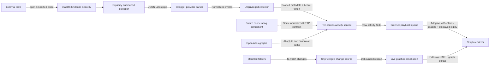

# Architecture

All runtime implementation lives under `.apm/extensions/cartograph/`.
The component paths below are relative to that directory. Documentation here is
hand-authored; there is no generated marketplace site or documentation generator.

| Component | Responsibility |
| --- | --- |
| `extension.mjs` | Copilot canvas lifecycle, actions, session working directory |
| `server.mjs` | Per-canvas loopback HTTP server, Atlas state, full-state SSE |
| `build-info.mjs` | Runtime version/source SHA; Git on source checkouts, then package/file stamps |
| `atlas/` | Store discovery, Markdown parsing, node linking and multi-Atlas merge |
| `atlas/chat.mjs` | Compact host-session activation card and local-search fallback for HTTP/dev |
| `atlas/cartograph-chat.md` | Bundled answering activation: read evidence, cite, report progress and acknowledge delivery |
| `atlas/chat-requests.mjs` | Bounded per-instance requests, idempotent replies, timeout and close cleanup |
| `atlas/schema.mjs` | Confined metadata-only schema catalog and deterministic ownership diagnostics |
| `atlas/watch.mjs` | Replaceable, unprivileged open-root filesystem change source |
| `atlas/live.mjs` | Debounced rescans, watcher status and explicit creation/deletion deltas |
| `public/` | Browser UI, graph layout, WebGL and Canvas 2D renderers |
| `public/universe.js` | Canonical universe layout; `atlas/universe.mjs` re-exports it for Node |
| `public/state-controls.js` | Shared serialised/coalesced optimistic state edits and revision-aware reconciliation |
| `public/layer-controls.js` | Node/relationship layer semantics using the shared state controller |
| `public/node-layers.js` | Shared type-key membership, counts and accepted layer-key normalization |
| `public/schema-layers.js` | Store-qualified schema/type controls with stable focus and diagnostics |
| `public/content-navigation.js` | Single delegated preview/wiki/external click handling |
| `public/source-links.js` | Safe source classification, local destination labels and accessible external-source rows |
| `public/node-browser.js` | Filtered, paginated native node controls and live focus preservation |
| `public/node-search.js` | Shared node descriptions and title/ID/Atlas/path/type/kind query matching |
| `http.mjs` | Shared request authorisation and bounded JSON object parsing |
| `paths.mjs` | Platform-aware directory containment |
| `public/activity-playback.js` | Adaptive visual queue, aggregation, display lifetimes, and pulse scheduling |
| `public/activity-camera.js` | Displayed-effect target selection, padded camera fit, manual override and idle restoration |
| `activity/model.mjs` | Exact file-to-node mapping, timers, temporal relationships |
| `activity/service.mjs` | Authenticated ingestion, settings, collector status, activity SSE |
| `activity/protocol.mjs` | Normalized access-event contract and common input limits |
| `activity/process-scope.mjs` | Process-scope validation and descendant/exclusion checks |
| `activity/providers/index.mjs` | Provider contract, registry, and explicit default selection |
| `activity/providers/eslogger.mjs` | macOS event parser, permissions, availability, setup and command |
| `activity/collector.mjs` | Provider-independent line-stream transport, scoping, batching and lifecycle |
| `dev.mjs` | Standalone development server using the same implementation |
| `fixtures/mini-atlas/` | Small local demonstration store |

## Native bootstrap boundary

`extension.mjs` calls the public SDK's
`joinSession({ canvases: [createCanvas(...)] })` without optional hooks.
`CanvasProviderOpenRequest.session.workingDirectory` supplies per-call cwd;
`session.rpc.metadata.snapshot().workingDirectory` is used only when that field
is omitted and the joined session and returned snapshot match the caller.
Invalid explicit context never falls through to another source. No process cwd
or global cwd cache participates. Absolute path, directory and lexical/canonical
installation checks happen before Atlas discovery or server creation.

The existing canvas instance retains its resolved workspace for relative actions.
Native `reload` uses the live service's immediate `refresh()` path, sharing
selection reconciliation, lifecycle deltas and error status with filesystem
notifications; explicit refresh also propagates scan failures to the action.
Watcher retry stays explicit, not part of status broadcasts. Activity retains
the current CLI parent PID and viewer-subtree exclusion independently of cwd.

The package smoke imports the deployed `extension.mjs` with a synthetic SDK
transport, then exercises its real handlers and server. The harness stays outside
the distributed runtime. It validates registration shape and data flow, not the
host's actual `session.resume` implementation or renderer; exact-artifact native
acceptance remains external to the local packaging check.

## Source provenance in previews

Frontmatter sources serve two different purposes: internal page references
participate in graph linking, while HTTP/HTTPS provenance opens an external
destination. External URLs retain their exact text; they must not pass through
internal slug normalization, which removes `.md` suffixes.

Preview metadata adds ordered `sourceDetails: [{ path, title? }]` while
retaining the existing `sources: string[]` graph contract. The browser
separates external-source rows from
internal relationship chips and derives fallback labels locally, including
GitHub destination types and repository/domain context. It escapes all source
metadata and does not fetch remote titles or favicons.

External rows use native links with an external-link indicator, keyboard focus
and full-URL disclosure on hover/focus. The shared delegated navigation handler
leaves external-source anchors to native browser activation, including Enter,
modified clicks and context menus, rather than also calling `window.open`.
External provenance does not introduce new graph nodes
or inferred relationships.

## Chat delivery

The SDK's `session.send()` resolves with a message ID, not answer text.
Cartograph ignores that ID as display content. Each submitted question creates
a UUID-correlated pending message. The prompt is only a fenced `text` activation
card with `activation: "cartograph-chat"`, `activation_path`, `routing`,
`question`, `atlases`, `selection` and `query`. Each field uses a JSON value;
embedded newlines and quotes cannot introduce card fields. The absolute
`activation_path` resolves to `atlas/cartograph-chat.md` in the runtime bundle.
The card contains no page bodies or duplicated answering/delivery instructions;
the agent loads that bundled file for the complete workflow. Atlas remains the
retrieval substrate, not the owner of the chat transport.

The agent calls `update_chat` with `status: working` when it begins and at
meaningful task-stage changes. Optional `text` is a nonempty, single-line
label capped at 160 UTF-8 bytes; omitted text retains the current label or
defaults to `Working…`. The server exposes validated labels as `progress`,
which the browser escapes as plain text rather than rendering pending Markdown.
Changed labels broadcast without resetting the request deadline; duplicate
labels do not broadcast. Completion removes progress and uses `status: answered`
with the full Markdown answer (or `failed` plus an explanation).
The action checks both instance ownership and the joined session, validates a
nonempty reply capped at 128 KiB, updates only that request, broadcasts the
revisioned snapshot and returns a delivery acknowledgement. Identical terminal
retries are idempotent; conflicting, foreign, missing and late replies fail.
No session-wide “latest assistant message” listener can misattribute unrelated
turns. Failure to report completion expires the request after ten minutes.
Timers are bounded by the 50-message history and released on trimming/close.
Closing cancels pending requests, not the host's whole session.

The browser distinguishes queued from working and shows reduced-motion-aware
pending dots. Only the request's progress changes its indicator: unrelated
session work does not make it appear active. The host transcript remains
host-owned, while answer delivery is explicitly to the canvas. Local HTTP/dev
search remains synchronous and does not activate the agent.

## Schema metadata flow

`readSchemaCatalog(root)` extracts type IDs from the base and contribution
`templates.by_type` objects. `store.schemaCatalog` contains schemas and
sanitized diagnostics; the merged graph exposes `schemas` and
`schemaDiagnostics` with originating Atlas labels. Descriptor keys are scoped
to the mounted root, with separate core/contribution and type components.
They identify controls and islands independently of display labels.

Nodes retain `type` and rendering `kind`, and expose `declaredType` plus optional
`typeKey`, `schemaKey` and `schemaLabel`. A missing or ambiguous declaration
leaves an explicitly typed node in **Undeclared types**. The shared
`nodeCategory` helper distinguishes those nodes from untyped navigation indexes
and other untyped pages across controls, previews and layout. No template contracts or additional schema
payloads are sent as catalog metadata. The `get_state` canvas action exposes
descriptors; `set_layers` accepts boolean updates keyed by type or relationship.
Schema group clicks expand into updates for their member type keys.

Schema-only filesystem changes use the existing full-state revision pipeline.
Server and browser reconcile layer keys and reveal newly undeclared pages.
Catalog changes during an in-flight edit rebase the desired layer state and
queue a corrected update rather than allowing the old acknowledgement to
restore removed keys or hide fallback pages.

## Runtime data flow

The receiver rejects invalid batches atomically and only accepts files present
in its current graph. Collector target refresh is an optimization and privacy
boundary, not the sole authorization check. The receiver ignores its own PID.
Copilot canvases additionally filter to the current CLI session's process tree,
excluding the viewer subtree. The provider supplies bounded process ancestry;
the shared receiver checks that scope independently of file-to-node mapping.
Background reads from unrelated host-app processes cannot activate the graph.
Receiver graph rebuilds preserve each alias's own activity record, keyed by its
lexical path, canonical target and Atlas mount. Exact node identities survive
first; unique matching identities allow single/multi-Atlas ID qualification.
New aliases never inherit activity, and ambiguous renames or changed targets
discard the old record rather than copying observations between instances.
All JSON POST routes share a one-MiB streamed byte limit, including chunked
uploads. Oversized input receives 413 before the upload ends; malformed, empty
or non-object JSON receives 400 without changing state. Origin/Host validation
and collector authentication still run before body parsing.
Full-state snapshots and UI acknowledgements include `layersRevision` and
`queryRevision`, incremented for their respective updates. HTTP and canvas query
actions share `setQuery`. The client serialises/coalesces optimistic edits and
uses these revisions to reject stale values while still accepting later external
edits. Search snapshots do not rewrite unchanged input, preserving its caret.
Every full-state payload also receives an increasing per-canvas `stateRevision`
when constructed, covering bootstrap, SSE connections/broadcasts and UI replies.
The browser rejects older/equal revisions before graph, selection, page or phase
updates; discarded payloads cannot arm transition timers. Field controllers still
preserve pending local intent within an accepted full snapshot. Late bootstrap
errors remain visible without replacing an already live map.

Default discovery skips unresolved symlink loops (`ELOOP`) as well as vanished
entries, while permission and other I/O errors remain visible. Proximity grouping
compresses union-find paths; Atlas and proximity home construction index the first
label for each key rather than scanning every node or assignment for every home.

Layers and Atlases pack deterministic local galaxies in `public/universe.js`.
Each group indexes mass-ranked siblings once (ID breaks ties); its highest-mass
24% occupy a spherical core, with three volumetric spiral arms and sparse halo
points around it. Arm heights fill most of the remaining bounded cross-section
at each radius. A pole-safe local coordinate frame retains spiral winding while
giving the bulk of the distribution visible side-on depth. Population-dependent
extents are capped inside separated group
volumes. Proximity keeps its existing placement. Render-only `galaxyCore` and
`galaxyRadius` metadata identify the core without creating graph nodes or edges.
The core is projected through the same camera as the stars and painted by the
shared 2D backdrop in both renderer modes.
The backdrop's expanding pulse is anchored to these projected cores, or exactly
to the selected node's projected position. It shares the render clock and
becomes static under reduced motion; it is separate from read-path pulses.

Galaxy home navigation uses the camera's radial-normal convention plus an
oblique offset, instead of aiming the plane edge-on. The original
0.16-radian/second idle rotation is the default 1× Layout speed, scalable from 0
to 2× and remembered in the browser, yielding to selected nodes, reduced
motion, manual orbit and navigation/activation targets. Large overviews fade
ordinary edge opacity from 28% at home zoom to full detail at 3x, keeping all
relationships. High-mass and interacted-with labels remain available at home
zoom; search, selection and detail zoom restore ordinary labels. The shared
`galaxyDetailOpacity` helper keeps WebGL and Canvas 2D consistent. There is no
force simulation, collector change or extra animation loop.

Interactive graph and node-list clicks use the atomic `activate` UI action:
resolve/select the node, then open its preview only if it was already selected.
First activation reuses the renderer's direct-neighbor highlighting. Resolving
the two stages on the server avoids racing selection and preview requests.
The explicit `select` action, page links and native `select_node` retain their
one-step page-preview behavior. Selection errors remain visible even while the
preview is closed.

Search has one always-visible toolbar input and one paginated result dropdown.
Typing opens matching results; Down also opens all-node browsing from an empty
field. Escape closes results and returns focus without hiding the query. Its query is
owned by the existing revision-aware state controller; the result list delegates
edits to that controller rather than keeping a second independent filter.
`node-search.js` supplies matching to results, both renderers and activation
framing. The app pre-indexes render nodes with normalized search text, including
store-label fallbacks, so renderer frames do not repeatedly build descriptions.
Results include hidden-layer nodes; the map still respects layer visibility.
Query errors reopen the results and show their alert. Selecting a match highlights its direct neighbors without clearing
the query or letting it dim that selected neighborhood.

Activity updates have their own SSE event and do not resend/rebuild the graph.
Raw observation expiry runs server-side. The browser coalesces repeated
pending accesses by node and plays at most one activation per frame, at intervals
of 400–50 ms, rather than delaying filesystem operations or transport. Display expiry
starts at playback time; natural server expiry does not cancel queued events.
Path segments are recorded only from the immediately preceding displayed
activation to the new one, when both endpoints are active and have a visible
graph relationship. They are not reconstructed from the set or order of active
nodes. Each relationship retains its latest actual traversal; other segments
keep their original direction and start time through node revisits.
Segments end with either endpoint or their own configured lifetime, whichever
comes first. Disabling or removing graph nodes clears
their pending and displayed activity. Both renderer paths share this playback;
WebGL does not pace a supplied, already-computed activity frame again.

The production canvas mount selects WebGL when available. A transparent GPU
layer renders all graph relationships, stars and transient effects between a 2D
backdrop (dust, beacon and island decorations) and a 2D text overlay. All three
layers share size, camera projection and one animation loop; decorative canvases
are hidden from assistive technology and never intercept pointer events.
Unavailable or failed WebGL initialisation retains the single-canvas 2D path.
Context loss switches to that path without resetting graph, selection or
playback, displays a status notice and releases GPU resources/listeners.
The shared render loop counts completed frames using uncapped RAF timestamps
and reports FPS beside the build badge at most once per second. A gap over
1.5 seconds or a non-increasing timestamp resets the sample; disposal clears
it. It adds no animation loop and does not treat the capped simulation timestep
as frame rate.

Depth-based target intervals are 400 ms for 1–5 pending nodes, 200 ms for 6–15,
100 ms for 16–40 and 50 ms for 41+. Oldest queue age lowers the target to at most
100 ms after two seconds and 50 ms after five seconds. Interval adjustment is
linear, taking 250 ms for the full acceleration range and two seconds for full
recovery. Queue age uses the first enqueue time, even when repeated observations
replace a pending node's latest metadata. One slot per visible graph node bounds
repeated traffic; unique-file backlog can still grow up to the visible graph size.
There is no catch-up loop that drains a hidden tab's backlog in one frame.

Each raw node exposes `sequence` (global accepted observation order), `count`
and `firstSequence` for its current active interval. Expiry, pause or removal
resets the interval; physical-file ID remapping preserves it. Playback uses
physical-file identities to remap pending/active records and traversed edges
when multi-Atlas qualification changes IDs. Hidden observations stay consumed
per node, including separate visible aliases of the same physical file,
until the source and displayed state no longer need them, preventing replay
when layers reappear. Playback uses counter deltas so heartbeats and same-millisecond batches cannot lose or double
count observations. Path edges require provably consecutive sequence ranges:
interleaved aggregation, missing observations and filtered intermediates cannot
manufacture shortcuts. Older snapshots without sequence metadata remain usable,
but repeated pending observations break ambiguous paths.

Relationship pair indexes avoid scanning every graph edge per activation.
Transient per-node observation counts and actual displayed traversal counts
feed the shared playback status; the UI updates at most every 200 ms. Counts
are not persistent history or proof of lossless capture. Collector errors remain
separate from queue pressure, and capture loss is explicitly unknown.

The API and extension actions continue to expose raw observations and co-active
relationships, not playback state or the displayed path. The browser does not
render the raw relationship list directly. Refreshing browser assets does not
change the collector URL or token.
Activity is transient per canvas, never a persistent access log. Closing a
canvas disposes clients, timers, and its HTTP listener.

Knowledge Activation includes a default-on, browser-page-local camera option.
The Canvas host owns camera projection (the WebGL renderer consumes projected
coordinates, not a separate camera). `activationFocusNodes` collects displayed
read nodes, lifecycle births/deletion ghosts and both endpoints of changed
relationships. Surviving ghost endpoints resolve by physical file identity.
Visible layers and query matches constrain targets. It never consumes raw
pending reads or puts ghosts back in the graph.

`ActivityCamera` fits these projected positions at most every 200 ms, using
80% of viewport width and 70% of height for padding, clamped to 0.22-20x zoom.
At the same cadence, mean unit radial normals select a front-facing surface
angle in the globe's yaw/pitch convention. Resultant length below 0.3 means
opposing/dispersed targets: retain the existing angle rather than chase noise.
An angular deadband of 0.08 radians suppresses small changes; yaw follows the
shortest arc and pitch stays within the existing +/-1.2-radian orbit limit.
The pivot stays fixed. Manual orbit retains pan/zoom following but suppresses
automatic orientation until five seconds after release.

Pan, logarithmic zoom and angles use critically damped motion with smooth times
of 0.55, 0.65 and 0.8 seconds, retaining velocity across target changes. Speeds
are limited to 1200 pixels/second for pan and 1.5 units/second for log zoom and
angles. Only single-node close-in framing uses a 0.3-second log-zoom smooth time
and a 4.5-unit/second speed limit. Its per-axis pan limit grows to twice the
distance from the saved framing per second (minimum 1200 pixels/second) to keep
the node in view as zoom increases. Pan damping and angular timing are unchanged.
Multi-node following, zoom-out and restoration use the normal limits.
Wider bounds request zoom-out immediately; zoom-in needs more than 8%
extra room sustained for 600 ms. A one-second idle hold precedes restoration
of saved pan/zoom/orientation; manual orbit updates the restoration angle.
Restoration captures its starting framing and interpolates screen-space pan
with zoom progress instead of running an independent pan spring that can lose
the Atlas mid-flight. New activity or manual navigation discards that trajectory.
Manual zoom/reset/island navigation cancels stale restoration and pauses all
following for five seconds. Selected-node focus and reduced-motion preferences
suppress it. Turning the
checkbox off holds the current framing, without changing read monitoring.
The setting resets to on on page reload; no backend configuration or collector
reconnection is involved.
Grouping changes discard stale activation-camera targets and pause following
for five seconds (initial mounting does not add a pause). Home/group navigation
uses the same critically damped, 1.5-radian/second shortest-angle movement as
activation orientation. Pitch targets stay within +/-1.2 radians, so accumulated
manual revolutions or polar groups cannot trigger long spins or unreachable goals.

Filesystem changes are independent of the read provider. `createFilesystemWatcher`
implements `setRoots(absolutePaths)` / `close()` and emits `onChange(root)` plus
`onStatus({status, message})`. `startServer` accepts a replacement through
`graphWatch.watcherFactory`. The native implementation uses recursive `fs.watch`
for each open root and a filtered parent watch to recover root replacement.
It never identifies an accessing process or escalates privileges.

`createLiveAtlas` debounces notifications for 150 ms, with a one-second maximum
wait. Rescans use strict I/O handling: inaccessible or invalid input surfaces an
error without committing a partial graph as mass deletion. Successful scans
update only the graph and selected page, preserving query, layers, grouping
and camera state; optional frontend framing then follows visible lifecycle
effects without resetting the layout. Graph equality suppresses duplicate lifecycle notifications.
Collector targets reconcile through the existing activity service.

Full-state snapshots include `graphWatch` and `graphChanges`. The latter carries
a monotonic `revision`, `origin` (`filesystem` or `mount`), `occurredAt`,
`durationMs` (3500), `createdNodeGlowDurationMs` (10000), `created` / `deleted` node arrays, and
`createdEdges` / `deletedEdges` relationship arrays. Deltas compare each
node's absolute Atlas file path, not mutable titles or qualified graph IDs.
Mount/detach changes clear lifecycle effects rather than pretending files were
created/deleted. Renderers deduplicate revisions and retain temporary deletion
ghosts outside their interactive node collections; these never become read-path
steps. Neither the watcher nor lifecycle effects depends on `activity.enabled`.
The shared 3500 ms lifecycle envelope controls whole-node opacity, labels and new
attached edges. Creation ramps from zero to full opacity; deletion ramps to
zero without scale/particle effects. A new node's green overlay has its own
ten-second deadline from creation: it becomes visible with the node's opacity
and fades smoothly to zero, independent of arrival. The entry retains separate
opacity/glow deadlines across graph remapping. Late creation deltas may show
the remaining glow after the 3.5-second opacity fade without replaying expired
relationship or deletion effects.
Reduced motion retains static markers instead of animated fades.
New edge deltas compare endpoint file identities, direction and relationship
kinds, so graph ID renumbering does not recreate existing links. The shared
lifecycle model fades new edges in and applies a green glow that rises and
falls over 3500 ms. Deleted edges leave the live graph immediately and render
as separate red ghosts fading out over the same duration. Ghosts snapshot the
previously visible edge and its endpoints; surviving endpoints follow current
positions by file identity, while deleted endpoints retain their old positions
and are reprojected with the camera. Recreation, unmounting and node or
relationship-layer filtering cancel ghosts. Neither renderer adds lifecycle
effects to the read path.

Monitor-specific code is isolated behind the
[provider contract](monitor-providers.md). A provider can adapt a line stream
or report normalized events directly. The activity model and renderers know
nothing about macOS, `sudo`, or the producer's event schema. Setup text comes
from the selected provider's public metadata, not hardcoded UI instructions.
Only `macos-eslogger` is shipped; it remains the default without fallback or
automatic switching. Multiple providers can be registered, with one selected
per canvas.

The repository's `.github/extensions/cartograph/extension.mjs` discovery shim
imports the canonical `.apm/extensions/cartograph/extension.mjs`. APM distributes
the canonical directory itself, so the installed entry point never imports
application code from outside its own bundle. Runtime package metadata keeps
browser JavaScript as ES modules even in a non-ESM consumer repository.
Node built-ins and the runtime-provided Copilot SDK are the only external
code dependencies; there is no compilation step or second implementation.
Fonts use the local system fallback stack; no remote stylesheet or font request
is needed to open the viewer.

UI mutations and path-scanning HTTP endpoints require
`X-Cartograph-Client: canvas`, the loopback Host, and same-origin Origin/fetch
metadata when supplied. Their POST bodies must be `application/json`.
The collector continues to use its separate bearer authentication.

Page loading confines lexical and canonical file paths to a mounted root.
Qualified node IDs retain their Atlas during page lookup and local chat excerpts;
unqualified links prefer the selected page's Atlas. Native canvas chat sends a
compact store/selection envelope to `session.send` on the joined host session
and does not load page bodies in the canvas process. Full-graph loading consumes
all available batches instead of treating a partial scan as complete.

Without an explicit root, initialization discovers the consumer workspace's
`.atlas/` stores and opens them together. This intentionally traverses the
normally hidden mount directory, not installed package caches or extension
fixtures. When no mounts are found, initialization shows the picker.
These external files supply graph data, never executable module imports.
